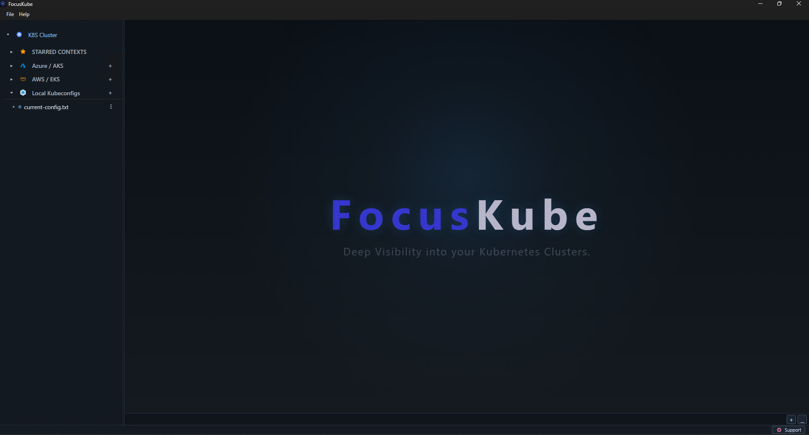
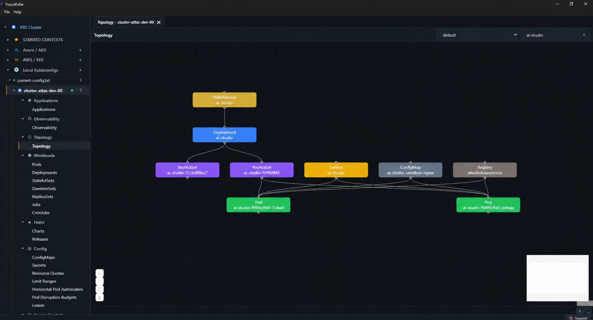

#  **FocusKube** - Deep visibility into your Kubernetes cluster!

### 

## **FocusKube** - Kubernetes Cluster Explorer & Operations Console

**FocusKube** is a free, open-source cross-platform Kubernetes Cluster Explorer & Operations Console, desktop GUI and multi-cluster management tool — a self-hosted alternative to Lens and k9s for teams running Azure AKS, AWS EKS, or local kubeconfig clusters. **FocusKube** allows you to browse cluster state, visualize workload topology, tail live logs over WebSockets, and manage Helm releases from one workspace — without giving up kubectl.

## Why **FocusKube**?

Kubernetes environments can quickly become complex. With multiple clusters, workloads, resources, events, logs, and relationships, finding the information that matters can be difficult.

**FocusKube** is built around a simple idea: focus on what matters inside your Kubernetes clusters.

The name combines:

- **Focus** — helping you inspect, understand, and troubleshoot the details that matter without getting lost in cluster complexity.
- **Kube** — a clear reference to Kubernetes, the platform FocusKube is designed to explore and operate.

**FocusKube** brings cluster information, resource relationships, topology, events, logs, and operational workflows into one focused experience.

**FocusKube** — Deep visibility into your Kubernetes clusters.

The goal is simple: less noise, more context, and a clearer view of what's happening in your clusters.

## Contents

- [Features](#features)
- [Prerequisites](#prerequisites)
- [Install the Desktop App](#install-the-desktop-app)
- [Development](#development)
- [License](#license)

## Features

### Multi-cluster management
- Connect to any number of **Azure AKS**, **AWS EKS**, and local **kubeconfig** contexts at once, side by side, without re-authenticating each time you switch.
- Star/pin frequently used contexts, scoped per-source so identically named clusters from different kubeconfigs never collide.
- Per-context auth probing (Azure CLI / AWS credential checks) with cached auth-check results to avoid hammering cloud APIs.

### Live streaming over WebSockets
- Dedicated WebSocket channels for **pod logs**, **multi-pod log tailing**, **exec terminals**, **port-forwarding**, **resource watches**, **live metrics**, and an **observability event bus** — all authenticated and RBAC-gated at the upgrade handshake, not just the HTTP layer.
- Resource lists update live via Kubernetes watch informers instead of polling, so the UI reflects cluster state within milliseconds of a change.
- Stream container logs from many pods at once in a unified, correlated view instead of tailing one pod at a time.

### Topology & dependency graphs
- Interactive, auto-laid-out (dagre) **topology graphs** showing how Deployments, StatefulSets, DaemonSets, ReplicaSets, Pods, Services, Ingresses, NetworkPolicies, ConfigMaps, Secrets, and Helm releases connect to each other.
- Filter the graph by application or namespace to isolate just the workload you're debugging, with pan/zoom, minimap, and live layout.

### Event recording & observability timelines
- Start a **recording session** per cluster/context that watches workload and Kubernetes Event changes (pod phase transitions, restarts, image changes, conditions, warning/normal events) and persists them with automatic retention (default 72h).
- Replay a **timeline** of what happened across a namespace, correlate related events in a dedicated correlation dashboard, and pick up recordings again after reconnecting — recording state survives client disconnects.
- Useful for answering "what changed right before this pod crashed?" without having to have been watching at the time.

### Full Helm lifecycle, with diff-before-apply
- Add repos, install charts, and upgrade releases from the UI, with a **diff viewer** that shows added/removed manifest lines *before* you commit to an upgrade.
- View release history and roll a release back to a previous revision.
- Deployment-level actions — **scale**, **rolling restart**, rollout **history**, and **rollback** — available straight from the resource view, no `kubectl` required.

### Built-in kubectl & Helm terminal — sandboxed, not a raw shell
- A command terminal that runs **only `kubectl` and `helm`** against the currently selected context/namespace over its own WebSocket channel — shell pipes, redirection, and arbitrary executables are rejected server-side, so it can't be turned into a general remote shell.
- Every command is logged with its outcome (success/failure, duration) for auditability, separate from the full interactive **exec-into-pod** terminal (which uses the pod's own shell and is gated behind write permission).

### Resource editing & creation
- Create resources from a **Monaco-powered YAML editor** with ready-to-edit sample manifests per kind (Deployment, Pod, and more), or edit any live resource's YAML in place and apply the change.
- Group workloads by application/Helm release across namespaces in a dedicated **Applications** view, with managed-by and version columns pulled from labels.
- Multi-namespace selection everywhere — view and filter resources across several namespaces at once instead of switching one at a time.
- Per-table column visibility that's remembered per view (persisted in local storage), so large resource lists stay readable.

### Day-to-day cluster operations
- Browse Kubernetes resources, workloads, and namespaces with fast, filterable tables.
- View logs, port-forward workloads, and open interactive exec terminals directly from the UI.
- Optional secret value reveal (gated behind an explicit environment flag and RBAC) for teams that want it.
- Run as a desktop app for a tighter local workflow on Windows, macOS, or Linux — or self-host the backend/frontend for a team-shared deployment.

### 🔒 Security, Privacy & Compliance First

Unlike many modern cloud-native dashboards that require cloud logins or track your behavior, **FocusKube** is built from the ground up to respect corporate firewalls, air-gapped environments, and developer privacy.

- **Zero Telemetry & Analytics:** The application never phones home. It collects absolutely no tracking data, session logs, or usage metrics. What happens in your cluster stays on your machine.
- **No Account Login Walls:** There are no corporate registration screens, cloud-sync dependencies, or subscription gates. You download the app, load your contexts, and start working instantly.
- **Air-Gapped Ready:** Because the application does not rely on third-party analytical tracking domains, it can be deployed seamlessly within highly secure, isolated, or restricted corporate networks.

## Getting Ready

## Prerequisites

- Access to an Azure AKS or AWS EKS cluster.
- [Azure CLI](https://learn.microsoft.com/cli/azure/install-azure-cli) for Azure authentication.
- [Helm](https://helm.sh/docs/intro/install/) for Helm operations.

The desktop app installs both of these automatically on first run if they're missing, so manual setup is optional.

## Install the Desktop App

Download the latest installer for your platform from the [Releases page](https://github.com/pradipspol/focusKube/releases), then:

### Windows
1. Run `focusKube-Setup-<version>.exe` or the `.msi`.
2. Launch FocusKube from the Start Menu.

### macOS
1. Open the `.dmg` and drag **FocusKube** into **Applications** (or unzip the `.zip` and move the `.app` there yourself).
2. The app isn't code-signed yet, so Gatekeeper will block the first launch. Right-click (or Control-click) the app in Finder and choose **Open**, then confirm in the dialog — you only need to do this once.

### Linux
- **AppImage**: `chmod +x focusKube-Setup-<version>.AppImage && ./focusKube-Setup-<version>.AppImage`
- **Debian/Ubuntu**: `sudo dpkg -i focusKube-Setup-<version>.deb` (or `sudo apt install ./focusKube-Setup-<version>.deb` to also resolve missing dependencies)

### After installing (any platform)
Sign in to Azure or AWS to connect to your AKS or EKS environments.

## Development

For development, refer to [DEVELOPMENT.md](DEVELOPMENT.md).

## License

This project is licensed under the Apache License 2.0. See [LICENSE](LICENSE) for details.
