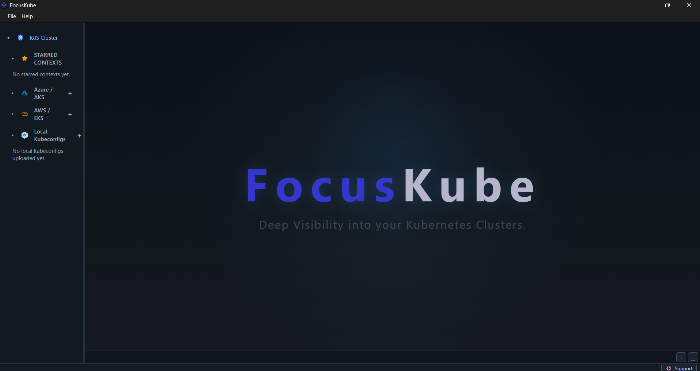
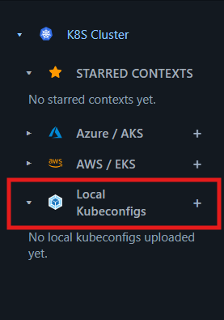
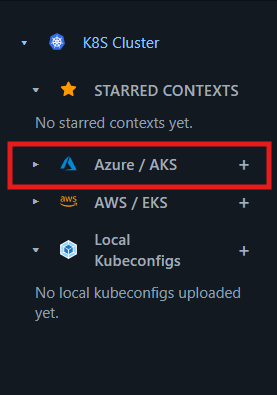
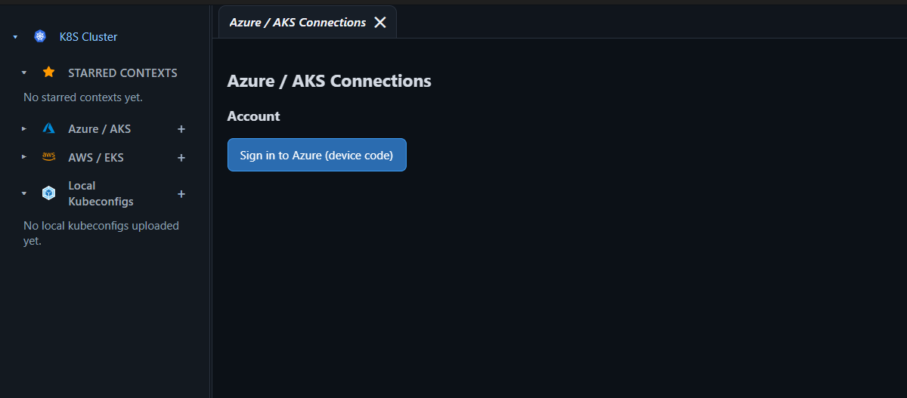
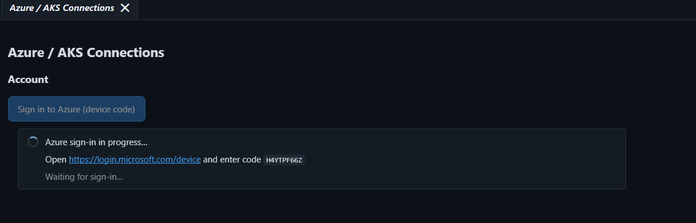
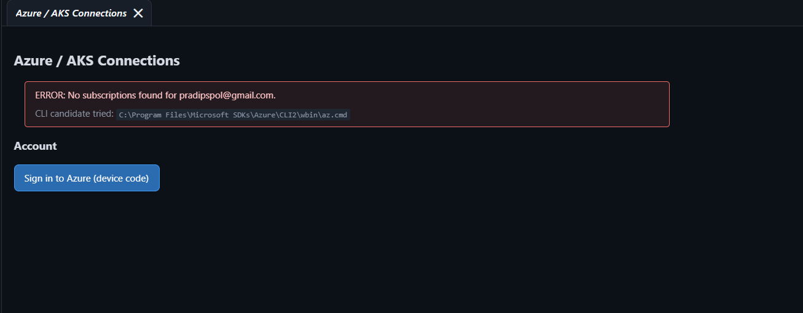
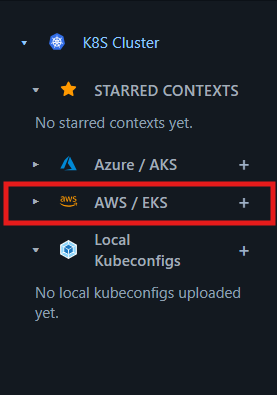
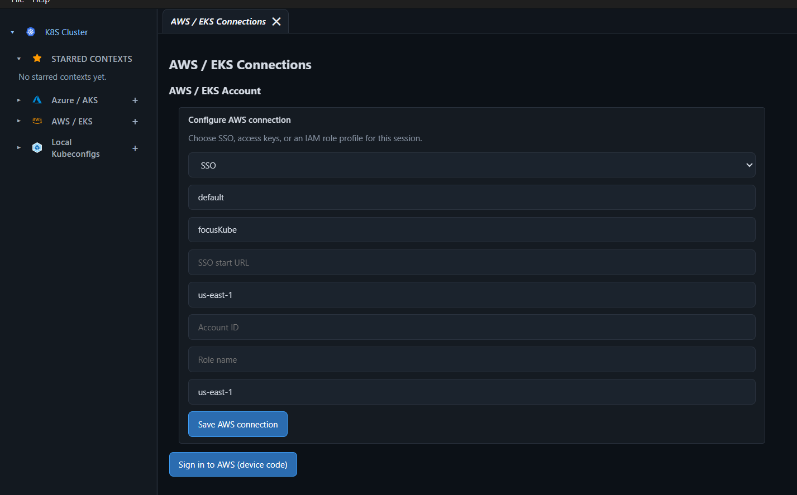
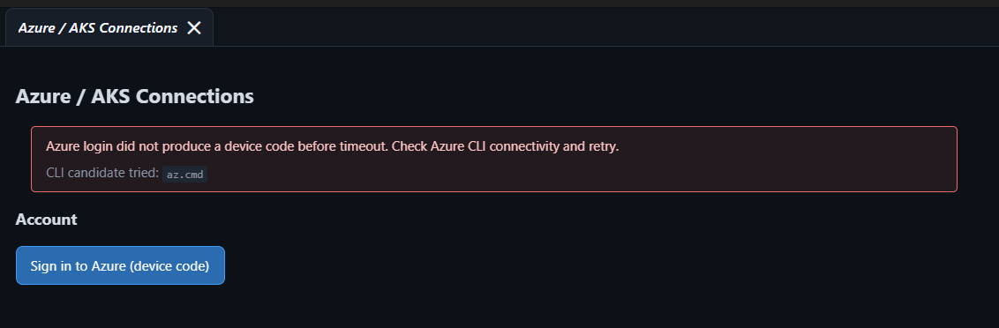

# How to Use FocusKube

FocusKube is a desktop Kubernetes explorer and operations console. Use it to inspect cluster resources, follow changes in real time, troubleshoot workloads, and perform common Kubernetes and Helm operations.

## 1. Start FocusKube

### Desktop application

1. Install the latest release for Windows, macOS, or Linux from the [Releases page](https://github.com/pradipspol/focusKube/releases).

- After installing, make sure, you have following things installed.
    - [Node.js](https://nodejs.org/en/download/) for running the application.
    - [Azure CLI](https://learn.microsoft.com/cli/azure/install-azure-cli) for Azure authentication.
    - [Helm](https://helm.sh/docs/intro/install/) for Helm operations.
    - [kubelogin](https://github.com/Azure/kubelogin) for Kubernetes operations.
    - [kubectl](https://kubernetes.io/docs/tasks/tools/install-kubectl/) For Terminal commands

2. Launch FocusKube.

3. Ater Launching, You will see a welcome screen with sidebar.
    - **STARRED CONTEXT**: You can pin your frequently used contexts for quick access that will be listed here.
    - **AZURE / AKS**: You can connect to your Azure AKS clusters by signing in with Azure CLI and loading the accessible Kubernetes cluster contexts across subscriptions.
    - **AWS / EKS**: You can connect to your AWS EKS clusters by signing in with AWS SSO/Secret Key and Id and loading the accessible Kubernetes cluster contexts across accounts.
    - **Local Kubeconfigs**: You can upload kubeconfig file to coonect to Kubernetes cluster contexts across kubeconfig files. You will be asked to sing in to Azure/AWS based on kubeconfig file

## 2. Connect to a cluster

FocusKube can work with local kubeconfig contexts and cloud-managed clusters.

- **Local or existing kubeconfig:** Make sure the desired context is present in your kubeconfig. 

After successful authentication, you will see a list of available contexts from Kubeconfig file. Select the desired context to load its resources.

- **Azure AKS:** Click **+** button -> **Add Azure Connection**
You will see Azure/AKS Connections Panel. Click **Sign in to Azure** to authenticate with Azure and load the accessible Kubernetes cluster contexts across subscriptions.
Sign in with Azure by opening link provided in azure panel and and use code displayed in panel.

After authentication, you will see a list of available subscriptions-> resource groups-> clusters on sidebar. Select the desired cluster to load its contexts.

If you dont have active subscription, you will see below message. Please make sure you have active subscription to connect to Azure AKS cluster.

- **AWS EKS:** Click **+** button -> **Add AWS Connection**

You will see below AWS/ EKS Connections Panel. Select **AWS SSO** or **AWS Access Key** or IAM Role to authenticate with AWS and load the accessible Kubernetes cluster contexts across accounts.

After authentication, You will see list of available regions and clusters. Select the desired cluster to load its contexts.

> FocusKube uses the permissions available to the selected Kubernetes identity. A context that can authenticate may still be unable to list, edit, or execute operations on a resource.

## 3. Explore resources

1. Select a context.
2. Choose one or more namespaces, or use **All namespaces** when your role permits it.
3. Open the resource or workload view you need.
4. Search and filter the table by name, namespace, or application.
5. Select a row to open its details and YAML.

Resource lists support live synchronization when the watch connection is active. Use **Refresh** when you need an immediate reload or when a watch has stopped.

The resource actions include:

- View details, labels, conditions, and events.
- Open pod logs.
- Open an interactive shell in a pod when your role permits exec access.
- Edit and apply resource YAML.
- Delete resources when you have delete permission.
- Restart deployments and inspect rollout history.
- Export the filtered table when you need a report or a copy for investigation.

Treat edit, delete, restart, and apply actions as production operations. Review the selected context and namespace before confirming them.

## 4. Find an application and understand its topology

Use **Applications** to group related workloads across namespaces. Application grouping uses Kubernetes labels such as the managed-by and version metadata when available.

Use **Topology** to see relationships between workloads and supporting resources, including deployments, pods, services, ingresses, network policies, config maps, secrets, and Helm releases.

To narrow the view, filter by application or namespace. Pan, zoom, and use the minimap to move around larger graphs.

## 5. Troubleshoot a workload

A typical investigation flow is:

1. Filter the workload or application by name.
2. Open the workload overview and check replica, readiness, condition, and restart information.
3. Review recent events and warning messages.
4. Open logs for the affected pod or container.
5. Compare related objects in the topology view.
6. Use **Exec** only when an interactive shell is necessary and your RBAC role allows it.
7. Apply a YAML change or trigger a rollout restart only after reviewing the target and intended result.

For investigations that span time, use **Observability** recording to capture workload and Kubernetes event changes. You can replay the timeline later and correlate related events across a namespace.

## 6. Work with Helm

Open **Helm Releases** to inspect releases in the selected context and namespace.

### Install a release

1. Add a Helm repository under **Repo catalog** if it is not already available.
2. Select an installable chart.
3. Enter a release name, target namespace, optional chart version, and values YAML.
4. Review the preview and manifest diff.
5. Install the release after checking the selected context and namespace.

### Upgrade or roll back a release

1. Select the release and open **Upgrade**.
2. Load the current values, choose a chart version, or edit values YAML.
3. Review the generated diff before applying the upgrade.
4. Use **History** to inspect revisions and roll back when necessary.

Helm actions change cluster state. Confirm the diff contains only the intended changes before applying it.

## 7. Forward a port locally

Use **Port Forwarding** to access a pod or service from your local machine:

1. Select the cluster context.
2. Choose **Pod** or **Service**.
3. Select the target resource and target port.
4. Choose a local port, then start forwarding.
5. Connect to `127.0.0.1:<local-port>` from a local browser or client.
6. Stop forwarding when finished.

Port forwarding runs against the currently selected context. A stopped or exited process is reported in the port-forwarding panel.

## 8. Run kubectl and Helm commands

The built-in command terminal runs `kubectl` and `helm` against the currently selected context and namespace. It rejects shell pipes, redirection, and arbitrary executables.

Use this terminal for focused inspection or a command that is not yet represented by a UI action. Commands are logged with their result and duration. For a shell inside a pod, use the separate **Exec** action instead.

## 9. Configure settings and security

Open **Preferences** from the user menu to adjust supported application settings, including theme and logging options where available.

- Keep cloud CLI credentials and kubeconfig files protected by your operating system account.
- Review the context, namespace, and diff before any write operation.
- FocusKube does not require a FocusKube cloud account and does not collect telemetry or analytics.

## Troubleshooting

### No contexts or resources appear

Check that the correct context is selected, the kubeconfig is readable, and your identity is authenticated. For Azure or AWS, renew the relevant CLI login and refresh the context list.

### A resource list says access is denied

Your Kubernetes role may not allow listing that resource across all namespaces. Select a namespace for which you have access, or ask a cluster administrator to review the RBAC binding.

### Live updates stop

Click **Refresh** and check the connection status. A reconnect or context change may be required after credentials expire.

### A Helm or port-forward operation fails

Confirm the target context, namespace, resource, and port. Then inspect the displayed command or error and verify that the selected identity has the required permissions.

## More information

- [Project overview and installation](../README.md)
- [Development and configuration](../DEVELOPMENT.md)
- [Kubernetes RBAC example](../k8s/backend-rbac.yaml)

## If you see Azure login did not produce code before timeout.

    - Az cli is not installed on your system or not in env path.
    - Run below command to install az cli on your system.
        - Windows: winget install --exact --id Microsoft.AzureCLI
        - MacOS: brew update && brew install azure-cli
        - Linux: curl -sL https://aka.ms/InstallAzureCLIDeb | sudo bash

 ## Reference commands to install missing dependencies on Windows 
    - Install Azure Cli:
      Windows: winget install --exact --id Microsoft.AzureCLI

    - install helm
      Windows: winget install --exact --id Helm.Helm

    - install kubelogin
      Windows: winget install --exact --id Microsoft.Azure.Kubelogin

    - install kubectl
      Windows: winget install --exact --id Kubernetes.kubectl